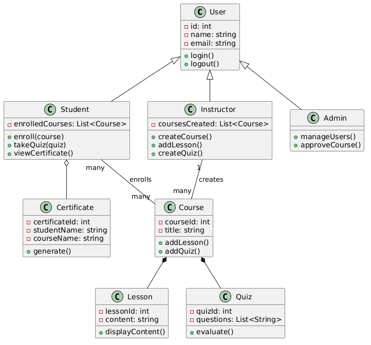
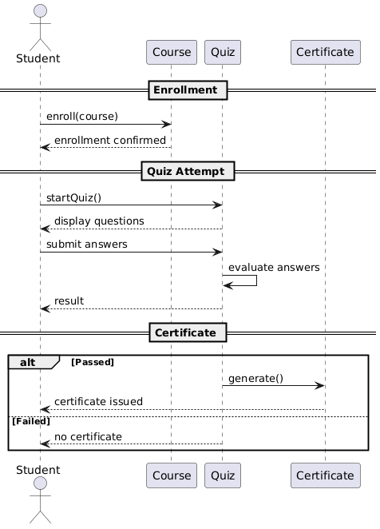

# Smart Learning Platform - UML Design

## 📌 Overview

This project contains UML diagrams for a Smart Learning Platform where students, instructors, and admins interact with courses, lessons, quizzes, and certificates.

---

## 🧩 Class Diagram

Represents the system structure including:

- Inheritance (User → Student, Instructor, Admin)
- Relationships (Association, Aggregation, Composition)

---

## 🔄 Sequence Diagram

Represents the flow of:
**Student enrolls in a course and completes a quiz**

---

## 🛠 Tools Used

- PlantUML

---

## 👩‍💻 Author

Heba Asker
